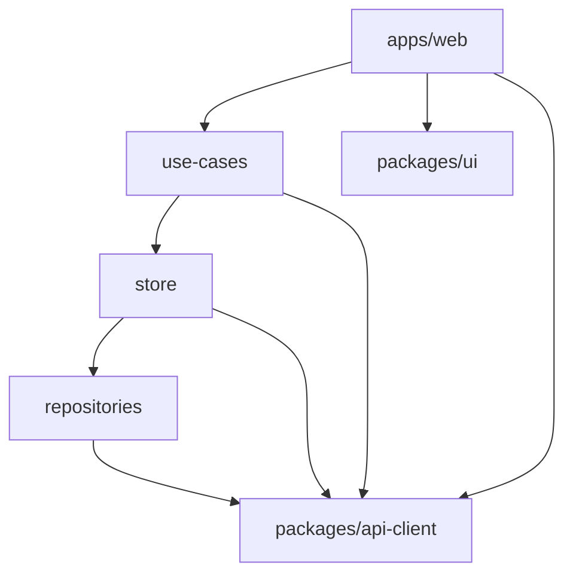

# PR template — worked example

This is a **reference**, not a template GitHub offers on PR creation (only
`PULL_REQUEST_TEMPLATE.md` is). It shows a fully filled PR for a real task
(T05, "Scaffold the leaf `packages/*` workspaces") and the exact commit it
squash-merges into. Use it to see the shape end-to-end. Source of truth for
the format stays `.claude/rules/commits.md`.

---

## 1. The PR title (becomes the squash commit subject)

```
:sparkles: feat(F-PLAT-001/T05): Scaffold shared packages
```

## 2. The PR description (pasted into the description box, template filled)

````markdown
<!--
  Review-only — stripped from the squashed commit.
  TITLE = commits.md subject: <gitmoji> <type>(<scope>): <subject> (≤50, imperative).

  Author self-check:
  [x] Title is a commits.md subject line
  [x] `bun run check` passes (Biome lint + bun run tsc)
  [x] `bun run test` passes
  [x] Layer direction intact; both packages import nothing internal (leaves)
  [x] Agnostic spine stays DOM-free; only apps/web may import packages/ui
  [x] Docs/rules updated if needed

  How to test:
    bun install && bun run check && bun run test

  Screenshots / notes:
    n/a — scaffolding only, no runtime behaviour yet.
-->

## Summary

Scaffold the two leaf `packages/*` workspaces — `api-client` (the
openapi-fetch transport, platform-agnostic) and `ui` (the Tailwind v4 +
shadcn design system, web-only) — as the leaves every tier imports. No
behaviour yet — each ships a typed stub, `package.json`, `tsconfig`, and a
smoke test so the layer graph compiles.

## What changed

- Added `packages/{api-client,ui}` with `@kotodama/*` names per `.claude/rules/naming.md`.
- `api-client` extends the DOM-free base tsconfig; `ui` extends the DOM one.
- Wired catalog versions; both import nothing internal (leaves).

## How it works

`packages/*` sit at the bottom of the chain: everything may import them,
they import nothing internal. `api-client` is agnostic (DOM-free, so a
future native app reuses it); `ui` is web-only, so only `apps/web` imports it.

<details><summary>Where packages/* sit in the layer graph</summary>



</details>

## Decisions

Decision: Split the design system (`ui`) from the transport (`api-client`)
into two leaves rather than one `packages/shared` — `ui` is DOM-bound and
must never enter the agnostic spine, and a DOM-free tsconfig on `api-client`
enforces that at `tsc` time; one merged package couldn't carry both lib
settings.

## Refs

Refs: https://www.notion.so/<T05-sub-task-url>
Closes #5
````

## 3. The squashed commit it produces

After GitHub strips the HTML comment, the commit on `main` is:

**Subject** (from the PR title):

```
:sparkles: feat(F-PLAT-001/T05): Scaffold shared packages
```

**Body** (from the PR description, comment gone):

```
## Summary

Scaffold the two leaf packages/* workspaces — api-client (the openapi-fetch
transport, platform-agnostic) and ui (the Tailwind v4 + shadcn design
system, web-only) — as the leaves every tier imports. No behaviour yet —
each ships a typed stub, package.json, tsconfig, and a smoke test so the
layer graph compiles.

## What changed
- Added packages/{api-client,ui} with @kotodama/* names per naming.md.
- api-client extends the DOM-free base tsconfig; ui extends the DOM one.
- Wired catalog versions; both import nothing internal (leaves).

## How it works
packages/* sit at the bottom of the chain: everything may import them, they
import nothing internal. api-client is agnostic (DOM-free); ui is web-only,
so only apps/web imports it.

<details><summary>Where packages/* sit in the layer graph</summary>
  …mermaid block renders on the commit page; raw git log shows it folded…
</details>

## Decisions
Decision: Split the design system (ui) from the transport (api-client) into
two leaves rather than one packages/shared — ui is DOM-bound and must never
enter the agnostic spine, and a DOM-free tsconfig on api-client enforces
that at tsc time; one merged package couldn't carry both lib settings.

## Refs
Refs: https://www.notion.so/<T05-sub-task-url>
Closes #5
```

The checklist, *How to test*, and reviewer notes lived in the HTML comment
and left no trace — but the Summary, Decisions, and the diagram survive, so
a future `git log -p` reconstructs WHAT + WHY without re-reading Notion.
